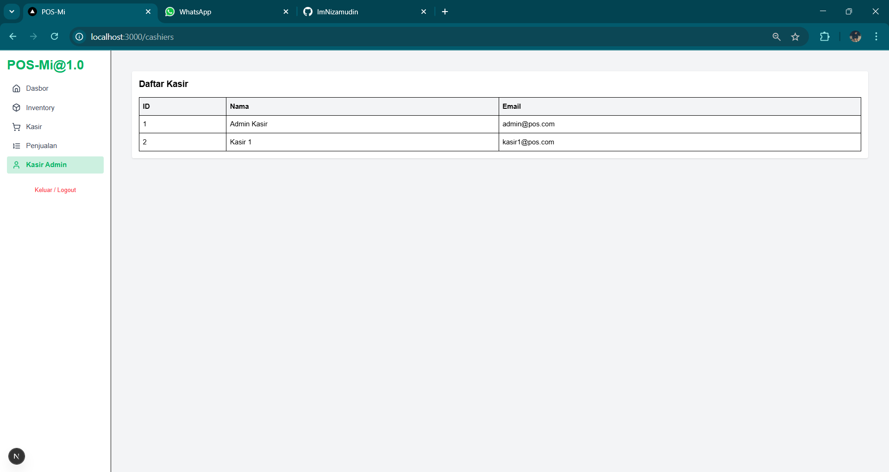

# 🧾 POS-Mi Frontend

Selamat datang di **POS-Mi Frontend** — Antarmuka kasir modern berbasis web untuk sistem **Point of Sale (POS)** berbasis microservices. Dirancang untuk memberikan pengalaman pengguna yang cepat, intuitif, dan responsif bagi kasir, admin gudang, hingga manajer penjualan.

> 🚀 Frontend ini dibangun dengan Next.js 14 dan Tailwind, terhubung ke backend microservices melalui API Gateway.

---

## 🔍 Apa itu POS-Mi?

**POS-Mi** (Point of Sale Microservices Indonesia) adalah aplikasi POS modern yang dibangun dengan arsitektur microservices, terintegrasi melalui REST API, dan menyajikan UI yang bersih serta efisien. Sistem ini terdiri dari berbagai service backend (inventory, sales, cashier, dsb.), dan frontend ini adalah pintu masuk utama bagi pengguna untuk berinteraksi dengan sistem.

### 🎯 Fitur Utama:
- Dashboard kasir interaktif
- Manajemen produk & stok
- Proses transaksi penjualan
- Riwayat dan detail struk penjualan
- Grafik penjualan real-time
- Navigasi sidebar modern & responsif

---

## 🛠️ Tech Stack

| Layer        | Teknologi                        |
|--------------|----------------------------------|
| Frontend     | **Next.js 14** (App Router)      |
| UI Framework | **Tailwind CSS**, Shadcn/ui      |
| Chart        | **Recharts**, Chart.js           |
| Routing      | Dynamic Layout + Nested Routing  |
| Backend API  | Terhubung ke Microservices via API Gateway |
| Auth & State | Context API, LocalStorage        |

---

## 📸 Hasil Project (Preview)





> Tambahkan cuplikan antarmuka dari proyek di sini — misalnya:
- ✅ Login Page
- 🧾 Halaman Kasir (Transaksi)
- 📦 Manajemen Inventori
- 📊 Dashboard dengan grafik penjualan
- 📃 Riwayat Penjualan & Struk

---

## 📚 Dokumentasi API

Berikut dokumentasi komunikasi antara frontend dengan backend via API Gateway:

| Halaman          | Method / Event                                              | Keterangan                        |
|------------------|-------------------------------------------------------------|-----------------------------------|
| `/inventory`     | `GET /products`, `GET /inventory`                          | Tampilkan produk & stok           |
| `/inventory/add` | `POST /products`, `POST /inventory`                        | Tambah produk dan stok            |
| `/order`         | `GET /products`, `POST /sales`, `POST /inventory/decrease`, `POST /receipts` | Transaksi dan cetak struk         |
| `/sales`         | `GET /sales`                                               | Riwayat penjualan                 |
| `/sales/receipt` | `GET /sales?saleId=1`                                      | Tampilkan detail struk            |
| `/login`         | `setCashier()` (localStorage)                              | Simpan nama kasir saat login      |
| `/logout`        | `logoutCashier()` (localStorage clear)                     | Logout dan redirect ke login      |

📄 Jika diperlukan, saya dapat bantu meng-export tabel ini menjadi PDF atau dokumentasi API resmi dalam format markdown.

---

## 🚀 Cara Menjalankan

```bash
# 1. Clone repositori
git clone https://github.com/ImNizamudin/pos-mi-frontend.git

# 2. Masuk ke folder project
cd pos-mi-frontend

# 3. Install dependencies
npm install

# 4. Jalankan development server
npm run dev
